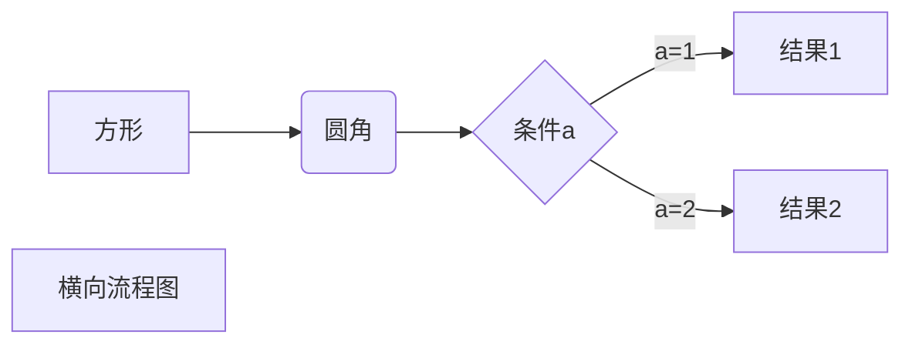

# Lab —— 模块化 C++ 游戏实验室

C++17 多模块项目，包含 4 个共享库（core/snake/gomoku/pacman）、一个文本处理模块（chat/、go/）、一个 C++ WebSocket 游戏服务器和一个 Vue 3 桌面前端。
所有游戏模块通过 `extern "C"` 6 函数 API 暴露，由 `main.cpp` 和游戏服务器经 `GameModule` 加载器动态加载。

## 目录结构

```
├── CMakeLists.txt        根构建文件
├── build.sh              一键构建脚本
├── main.cpp              Demo 入口（链接 libcore，dlopen 加载游戏模块）
├── start.sh              一键启动脚本（游戏服务器 + 前端）
├── backend/
│   └── main.cpp          游戏 + 聊天服务器（WebSocket :3001）
├── frontend/             Vue 3 + Vite 桌面前端
│   └── public/res/       资源文件（图片、视频、音频）
├── module/
│   ├── module.md         模块开发规范（新增模块请遵循）
│   ├── game/             游戏基础设施（Game基类、Direction、GameModule加载器）
│   ├── core/             并发 & 网络工具库（含 httpsPostStream）
│   │   ├── wsutil        URL 解析 + JSON 工具函数
│   │   └── netconn       HTTP/WebSocket + HTTPS 流式请求
│   ├── snake/            终端贪食蛇游戏
│   ├── gomoku/           终端五子棋游戏
│   ├── pacman/           终端吃豆豆游戏
│   ├── chat/             文本处理模块（回调追加"喵"）
│   └── go/               围棋游戏
├── 3rd/
│   └── win11React/       Win11 React 桌面集成（可选）
└── README.md             本文档
```

## 文档索引

- [frontend/README.md](frontend/README.md)
- [module/game/README.md](module/game/README.md)
- [module/core/README.md](module/core/README.md)
- [module/snake/README.md](module/snake/README.md)
- [module/gomoku/README.md](module/gomoku/README.md)
- [module/pacman/README.md](module/pacman/README.md)
- [module/go/README.md](module/go/README.md)
- [module/chat/README.md](module/chat/README.md)

## 模块

| 模块 | 库文件 | 说明 |
|------|--------|------|
| [`game`](module/game/README.md) | `libgame.so` | Game 抽象基类、Direction 工具、GameModule 加载器（dlopen 封装） |
| [`core`](module/core/README.md) | `libcore.so` | ThreadPool, Timer, Logger, EventManager, NetConn（HTTP/WebSocket）, httpsPostStream（SSE 流式 HTTPS 请求）, wsutil（URL 解析 + JSON 序列化） |
| [`snake`](module/snake/README.md) | `libsnake.so` | 贪食蛇，终端渲染，方向键控制 |
| [`gomoku`](module/gomoku/README.md) | `libgomoku.so` | 五子棋，15×15 棋盘 |
| [`pacman`](module/pacman/README.md) | `libpacman.so` | 吃豆豆，方向键控制，吃豆得分 |
| [`go`](module/go/README.md) | `libgo.so` | 围棋，19×19 棋盘，数子法 3.75 子贴目 |
| [`chat`](module/chat/README.md) | `libchat.so` | 文本处理，通过回调追加"喵"到输入末尾 |

游戏模块遵循统一规范：`include/`、`src/`、`test/`、`benchmark/` 各配中文 README，`extern "C"` 导出 `game_new`、`game_free`、`game_tick`、`game_is_over`、`game_get_score`、`game_get_state`。`getState()` 使用 `boost::json::object` + `boost::json::serialize()` 生成合法 JSON。`chat` 模块采用独立的 C API（`chat_new`/`chat_free`/`chat_process`）。

## 依赖

- C++17 编译器（GCC 11+）
- CMake ≥ 3.12
- Boost（url, json, filesystem）— core 模块直接链接，游戏模块链接 `Boost::json`
- OpenSSL — core 模块链接
- Google Test — 独立构建测试时
- Google Benchmark — 独立构建基准测试时
- Node.js ≥ 18 — 前端（推荐 22+）

## 构建与运行

```bash
# 一键构建 C++
./build.sh
# 或手动：
mkdir -p build && cd build
cmake .. -DCMAKE_BUILD_TYPE=Release
make -j$(nproc)
cd ..

# 运行 demo（链接 libcore.so，dlopen 加载游戏模块）
LD_LIBRARY_PATH=build/output/lib ./build/demo

# Demo 输出顺序：NetConn → Chat → Pac-Man → Gomoku → Snake → Go
```

### 独立构建单个模块

```bash
cd module/core     # 或 snake / gomoku / pacman / chat / go
mkdir build && cd build
cmake .. -DCMAKE_BUILD_TYPE=Release
make tests                    # 编译单元测试
./output/test/tests           # 运行测试
make bench                    # 编译基准测试
./output/bench/bench_timer    # 运行基准测试
```

### 游戏服务器

```bash
# 构建（已包含在 make 中）
cd build && make -j$(nproc)

# 运行（监听 0.0.0.0:3001）
LD_LIBRARY_PATH=output/lib ./output/gameserver
```

服务器提供两种 WebSocket 端点：
- 普通路径（`/`）：游戏 WebSocket（snake / pacman / gomoku / go）
- `/chat`：聊天 WebSocket，流式调用 DeepSeek API（`deepseek-v4-flash`），支持指令 `/图片`、`/视频`、`/音乐`、`/游戏xxx`

### 前端

```bash
cd frontend
npm install --ignore-scripts   # WSL 下需跳过 esbuild postinstall
npm run dev                    # 启动 Vite 开发服务器
# 访问 http://localhost:5173/
# 需要游戏服务器（端口 3001）同时运行
```

前端是 Win11 风格的桌面环境，包含：
- 桌面图标网格（贪食蛇、吃豆豆、五子棋、围棋、Chat 喵）
- 可拖动、缩放、最小化/最大化/关闭的窗口（iframe 嵌入各 App）
- 底部任务栏：窗口切换按钮 + 时钟
- 同一 App 可打开多个独立窗口
- 聊天页面：流式 Markdown 渲染，嵌入图片/视频/音频/游戏

## 一键启动

```bash
./start.sh
# 自动构建 C++、启动游戏服务器（:3001）和前端（:5173）
# Ctrl+C 优雅终止所有服务
```

## 设计要点

- **统一加载模式**：所有游戏模块导出相同 `extern "C"` 6 函数签名，`GameModule` 封装 `dlopen` + `boost::dll` 缓存加载
- **代码复用**：`wsutil` 抽取 URL 解析和 JSON 工具函数到 core，`backend/main.cpp` 复用 `httpsPostStream` 做流式 HTTPS 请求
- **Core 直接链接**：`main.cpp` 和 `gameserver` 直接链接 `libcore.so`（不通过 dlopen），仅游戏模块动态加载
- **游戏状态输出**：`getState()` 使用 `boost::json::object` + `boost::json::serialize()` 生成合法 JSON，无需手工拼接和转义
- **NetConn**：基于 Boost.Asio + ThreadPool 的异步 HTTP/WebSocket 客户端，含自动重连
- **httpsPostStream**：同步 HTTPS 请求 + SSE 行级回调，OpenSSL 支持，30s 超时
- **游戏服务器**：C++ 原生 WebSocket 服务器，thread-per-connection 模型，路径路由区分游戏/聊天
- **聊天服务器**：WebSocket 接收用户消息 → 调用 DeepSeek API → 流式 `stream_start`/`delta`/`stream_end` 协议推回前端；支持 `/图片`、`/视频`、`/音乐`、`/游戏xxx` 指令
- **前端**：Vue 3 + vue-router（hash 模式）桌面环境，Composition API + `<script setup>`，WebSocket 直连服务器（无 Vite 代理），Win11 窗口系统（拖动/缩放/最小化/最大化/关闭），Markdown 渲染（marked），CSS Grid 渲染游戏网格，游戏配置集中至 `src/config/games.js`，路由自动生成
- **WSL 兼容**：`vite.config.js` 设 `host: '0.0.0.0'` 及 `cacheDir: 'node_modules/.vite'` 规避 UNC 路径问题
